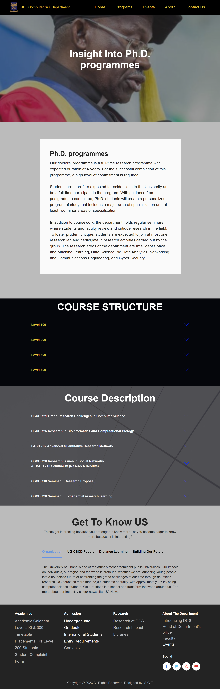

# Computer Science Department Website

# Introduction
Welcome to the Computer Science Department Website! This website serves as a central hub for information, resources, and updates related to the Computer Science Department at  University of Ghana. Whether you're a student, faculty member, or visitor, this platform aims to provide a seamless experience for accessing important information and staying connected with the department's activities.

# Purpose
The primary purposes of this website include:

Information Hub: Access relevant departmental information such as course offerings, faculty profiles, and research opportunities.

Announcements: Stay updated on important announcements, events, and deadlines.

Resources: Find educational resources, programming tools, and links to helpful websites.

Community: Foster a sense of community among students and faculty through discussion forums and collaborative spaces.

# Cloning and Setup Instructions
To set up the project locally, follow these steps:

1. Clone the Repository:

git clone https://github.com/gyasifordjour/DCIT_205_IA.git

2. Install Dependencies:
npm install

3. Run the Development Server:
npm start
The website will be accessible at http://localhost:3000 in your web browser.

4. Build for Production:
npm run build

Author
Name:  Fordjour Gyasi Samuel
Number: 0248425044
Email: samuelgyasifordjour@gmail.com

Screenshots of each page

# What I've Learned
Throughout the development of this project, I've gained valuable experience and skills, including:

Web Development: Understanding the intricacies of building a responsive and interactive website using modern web technologies.

User Experience Design: Enhancing the user experience through intuitive navigation, responsive design, and engaging content presentation.

Version Control: I have had more insight into the use of Git and Github. That is how to fork a repository, make a commit, and make a pull request. Furthermore, some mistakes led me to do further research, like how to undo a commit, revert and reset a commit, and also how to delete a repository.

Contributing
I welcome contributions from my coursemates and adding new features, or improving documentation, your contributions make this project better for everyone. Check out our Contributing Guidelines for more information.

Thank you for your interest and contributions to the Computer Science Website Department project! Feel free to explore the codebase, contribute, and provide feedback. We appreciate your interest and involvement in the Computer Science Department Website!

